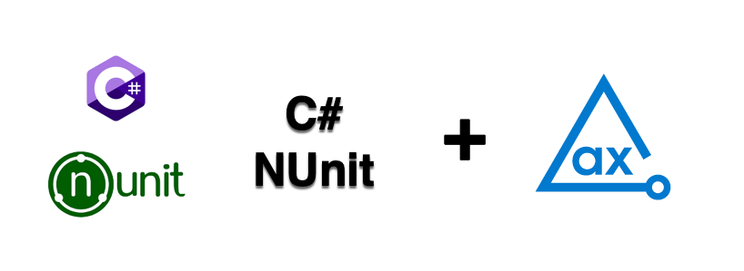

# axe DevTools C# NUnit API Example

Using axe DevTools C# NUnit, you can integrate axe DevTools into your existing testing environment. This example project demonstrates how axe DevTools C# NUnit is used to detect accessibility issues and generates reports in JSON format.

## [Prerequisites](https://docs.deque.com/devtools-html/4.0.0/en/cs-install-options#prerequisites)

- dotnet
- Selenium WebDriver for Chrome

## Clone Project

Follow these steps to clone and navigate to the directory:

1. Clone this repo from GitHub.
2. Open the project in your favourite editor.
3. Navigate from the root of the repo to this example with the following command:

```sh
cd C#/NUnit
```

## Test Configuration

To run this example project, you have to configure your artifactory credentials.

> **_NOTE:_**
> You need a valid license to use our APIs. For more information, see [Deque’s Agora](https://agora.dequecloud.com/ui/packages#/home) page. After configuring the access to Deque's private registry, you can install the packages for this project.

Do one of the following methods based on your machine:

#### Windows Users

1. Open **`nuget.config`** file.
2. Enter the details as follows in the <ArtifactoryWindows>:

   - Email (value="%ARTIFACTORY_USERNAME%")
   - API Key (value="%ARTIFACTORY_PASSWORD%")

   ```sh
       <ArtifactoryWindows>
           <add key="Username" value="%ARTIFACTORY_USERNAME%" />
           <add key="ClearTextPassword" value="%ARTIFACTORY_PASSWORD%" />
       </ArtifactoryWindows>
   ```

3. Remove the following lines:

   ```sh
       <ArtifactoryUnix>
           <add key="Username" value="%ARTIFACTORY_USERNAME%" />
           <add key="ClearTextPassword" value="%ARTIFACTORY_PASSWORD%" />
       </ArtifactoryUnix>
   ```

   ```sh
       <add key="ArtifactoryUnix" value="https://agora.dequecloud.com/artifactory/api/nuget/devtools-nuget/" />
   ```

4. Save the file.

#### Unix Users

1. Open **`nuget.config`** file.
2. Enter the details as follows in the <ArtifactoryUnix>:

   - Email (value="%ARTIFACTORY_USERNAME%")
   - API Key (value="%ARTIFACTORY_PASSWORD%")

   ```sh
       <ArtifactoryUnix>
           <add key="Username" value="%ARTIFACTORY_USERNAME%" />
           <add key="ClearTextPassword" value="%ARTIFACTORY_PASSWORD%" />
       </ArtifactoryUnix>
   ```

3. Remove the following lines:

   ```sh
       <ArtifactoryWindows>
           <add key="Username" value="%ARTIFACTORY_USERNAME%" />
           <add key="ClearTextPassword" value="%ARTIFACTORY_PASSWORD%" />
       </ArtifactoryWindows>
   ```

   ```sh
       <add key="ArtifactoryWindows" value="https://agora.dequecloud.com/artifactory/api/nuget/devtools-nuget/" />
   ```

4. Save the file.

## Install axe DevTools Selenium Package

The following command installs **axe DevTools Selenium** package to run this example project.

```sh
dotnet add package axe-devtools-selenium
```

## Run Tests

The example test file **`Example.cs`** analyzes the page `https://broken-workshop.dequelabs.com/` for accessibility issues.

The following command runs the test file:

```sh
dotnet test
```

## Test Reports

The tests generate results in the **_reports_** directory.

Every time you run **`dotnet run`**, it replaces all previously saved reports with the latest reports in the **`reports`** directory, so if you want to retain previous test reports, you should rename or save them in a different directory.

## Additional Information

- [axe DevTools C# Overview](https://docs.deque.com/devtools-html/4.0.0/en/cs-overview)
- [C# API Reference](https://docs.deque.com/devtools-html/4.0.0/en/cs-api)
- [Writing Tests](https://docs.deque.com/devtools-html/4.0.0/en/cs-writing-tests)
- [axe-core Rule Descriptions](https://github.com/dequelabs/axe-core/blob/master/doc/rule-descriptions.md)
