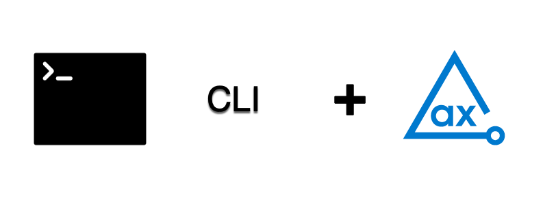

# axe DevTools CLI Example

This example project demonstrates how axe DevTools CLI is used to detect accessibility issues and generates reports in CSV, HTML, JSON, and XML formats.

## Prerequisites

- Install the [Driver](https://docs.deque.com/devtools-html/4.0.0/en/cli-install-home#requirements) for the browser you choose to use for the testing.
- You need a valid license to use our CLI. For more information, see [Install from Deque’s Agora](https://docs.deque.com/devtools-html/4.0.0/en/cli-install-nodejs) page.

## Clone Project

Follow these steps to clone and navigate to the directory:
1. Clone this repo from GitHub.
2. Open the command window and navigate from the root of the repo to this example with the following command:

```sh
cd CLI
```

## Spec File

The **`example_spec.json`** is a spec file that describes the pages to test. The page list is grouped in projects, which can be used to organize tests. Each page can have a list of actions that describe a workflow. For more information, see [Spec files](https://docs.deque.com/devtools-html/4.0.0/en/cli-workflow-specs#spec-files) section of the CLI documentation.


## Run Tests

The **`example_spec.json`** file analyzes the page `https://broken-workshop.dequelabs.com/` for accessibility issues.

The following command runs the test.

```sh
axe spec example_spec.json ./a11y-results --format html
```

## Test Results

The tests generate results in the **_a11y-results_** directory in HTML. For more information, see [Output directory](https://docs.deque.com/devtools-html/4.0.0/en/cli-workflow-specs#output-directory) section of the CLI documentation.

The **`executive-report.html`** file is an executive summary report aggregating results from all scans into one page. 
 

## Additional Information

- [axe DevTools CLI Overview](https://docs.deque.com/devtools-html/4.0.0/en/cli-home)
- [axe-core Rule Descriptions](https://github.com/dequelabs/axe-core/blob/master/doc/rule-descriptions.md)

 