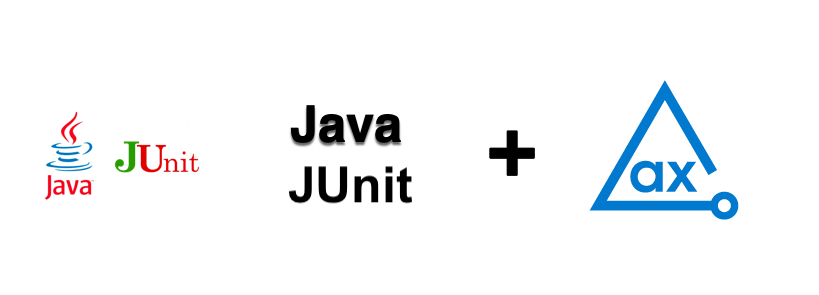

# axe DevTools Java JUnit with Gradle API Example

Using axe DevTools Java JUnit with Gradle, you can integrate axe DevTools into your existing testing environment. This example project demonstrates how axe DevTools Java JUnit with Gradle is used to detect accessibility issues and generates reports in CSV, HTML, JSON, and XML formats.

## Prerequisites

Java 8 or higher
Gradle 7.5.1 or higher

## Clone Project

Follow these steps to clone and navigate to the directory:
1. Clone this repo from GitHub.
2. Open the project in your favourite Java IDE.
3. Navigate from the root of the repo to this example with the following command:

```sh
cd Java/gradle-junit
```

## Binary Reporter

Download the respective [Binary reporter](https://docs.deque.com/devtools-html/4.0.0/en/downloads#binary-reporter) for your operating system and place it in the **_src/test/resources_** directory.

### MAC Operating System (Default)

The default file set to MAC Operating System users.

```sh
    String reporter = new File("src/test/resources/reporter-cli-macos").getAbsolutePath();
```

Other than MAC Operating System users, open the **exampleTest.java** file and modify the file as per your operating system.

### Linux Operating System Users

Update the line 56 as follows:

```sh
    String reporter = new File("src/test/resources/reporter-cli-linux").getAbsolutePath();
```

### Windows Operating System Users

Update the line 56 as follows:

```sh
    String reporter = new File("src/test/resources/reporter-cli-win.exe").getAbsolutePath();
```
        
## Install Dependencies

Install the dependencies including **axe DevTools Selenium** for the project.

> **_NOTE:_**
>You need a valid license to use our APIs. For more information, see [Deque’s Agora](https://docs.deque.com/devtools-html/4.0.0/en/java-install-agora#accessing-your-api-key) page. 

Open **lib/build.gradle** and enter credentials, `$mavenUser` as email and `$mavenPassword` as API Key.

After configuring the access to Deque's private registry, you can install the dependencies for this project.

The following command installs all the required dependencies and runs this example project.

```sh
gradle buildDependents
```

The **_/lib/src/test/java/gradle/junit_** directory contains the file **`exampleTest.java`** that analyzes the page `https://broken-workshop.dequelabs.com/` for accessibility issues.

The following comand runs the test again.

```sh
gradle clean test
```

## Test Results

The tests generate results in the **_a11y-results_** directory if you have installed the [Binary reporter](https://docs.deque.com/devtools-html/4.0.0/en/downloads#binary-reporter). Otherwise, they generate only JSON results.

The **`executive-report.html`** file is an executive summary report aggregating results from all scans into one page.

Every time you run **`gradle clean test`**, it replaces all previously saved results with the latest results in the **`a11y-results`** directory, so if you want to retain previous test results, you should rename or save them in a different directory. 

If you want to modify this project and publish your results in a folder other than **`ally-results`**, you should update the output directory in the **`exampleTest.java`** file. 

## Additional Information

- [axe DevTools Java Overview](https://docs.deque.com/devtools-html/4.0.0/en/java-use-overview)
- [Java API Reference](https://docs.deque.com/devtools-html/4.0.0/en/java-api-docs)
- [axe-core Rule Descriptions](https://github.com/dequelabs/axe-core/blob/master/doc/rule-descriptions.md)
