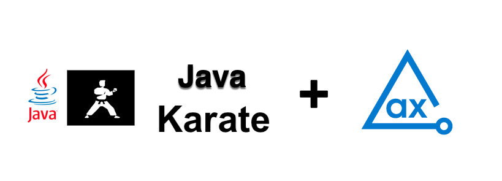

# axe DevTools Java Karate API Example

Using axe DevTools Java Karate, you can integrate axe DevTools into your existing testing environment. This example project demonstrates how axe DevTools Java Karate is used to detect accessibility issues and generates reports in CSV, HTML, JSON, and XML formats.

## Prerequisites

* Java 8 or higher
* Ensure to use the ChromeDriver version same as the Browser version.

## Clone Project

Follow these steps to clone and navigate to the directory:

1. Clone this repo from GitHub.
2. Open the project in your favourite Java IDE.
3. Navigate from the root of the repo to this example with the following command:

```sh
cd Java/karate
```

## Binary Reporter

Follow these steps to add binary reporter for publishing results:

Download the respective [Binary reporter](https://docs.deque.com/devtools-html/4.0.0/en/downloads#binary-reporter) and place it in the **_resources_** directory.

### MAC Operating System (Default)

The default file set to MAC Operating System users.

```sh
    "src/test/resources/reporter-cli-macos"
```

Other than MAC Operating System users, open the **axeFunctions/Functions.java** file and modify the file as per your operating system.

### Linux Operating System Users

Update the line 31 as follows:

```sh
    "src/test/resources/reporter-cli-linux"
```

### Windows Operating System Users

Update the line 31 as follows:

```sh
    "src/test/resources/reporter-cli-win.exe"
```

## Install Dependencies

Install the dependencies including **axe DevTools Java Selenium** for the project.

> **_NOTE:_**
> You need a valid license to use our APIs. For more information, see [Install from Deque’s Agora](https://docs.deque.com/devtools-html/4.0.0/en/java-install-agora) page. After configuring the access to Deque's private registry, you can install the dependencies for this project.

The following command installs all the required dependencies to run this example project.

```sh
mvn clean install
```

## Run Tests

The **_/src/test/java/testRunner_** directory contains the file **`ExampleTest.java`** that analyzes the page `https://broken-workshop.dequelabs.com/` for accessibility issues.

The following command runs the file in the **_/src/test/java/testRunner** directory.

```sh
mvn test
```

## Test Results

The tests generate results in the **_a11y-results_** directory if you have installed the [Binary reporter](https://docs.deque.com/devtools-html/4.0.0/en/downloads#binary-reporter). Otherwise, they generate only JSON results.

The **`executive-report.html`** file is an executive summary report aggregating results from all scans into one page.

Every time you run **`mvn test`**, it replaces all previously saved results with the latest results in the **`a11y-results`** directory, so if you want to retain previous test results, you should rename or save them in a different directory.

If you want to modify this project and publish your results in a folder other than **`ally-results`**, you should update the output directory in the **`axeFunctions/Functions.java`** file.

## Additional Information

 [axe-core Rule Descriptions](https://github.com/dequelabs/axe-core/blob/master/doc/rule-descriptions.md)