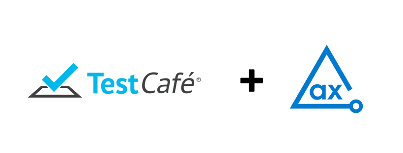

# AxeTestCafe

Using axe DevTools TestCafe, you can integrate axe DevTools into your existing testing environment. This example project demonstrates how axe DevTools TestCafe is used to detect accessibility issues and generates reports in CSV, HTML, JSON, and XML formats..

## Prerequisites

- NodeJS(6.10 or higher)
- Testcafe testing suite
- Chromedriver or Geckodriver

## Clone Project

Follow these steps to clone and navigate to the directory:

1. Clone this repo from GitHub.
2. Open the project in your favourite editor.
3. Navigate from the root of the repo to this example with the following command:

```sh
cd Node/axeTestcafe
```

## Install Dependencies

Install the dependencies including **TestCafe** and **DevTools Reporter** for the project.

> **_NOTE:_**
> You need a valid license to use our APIs. For more information, see [Install from Deque’s Agora](https://docs.deque.com/devtools-html/4.0.0/en/node-pl-install-agora) page. After configuring the access to Deque's private registry, you can install the dependencies for this project.

The following command installs all the required dependencies to run this example project.

```sh
npm install
```

## Run Tests

This directory contains the example test file **`spec1.js`** that analyzes the page `https://broken-workshop.dequelabs.com/` for accessibility issues.

The following command runs the test file.

```sh
npm test
```

This module uses a chainable API to assist in injecting, configuring and analyzing issues
using axe-devtools with TestCafe. Pass an instance of a TestCafe `t` (testable) object.

Here is an example of the script and use case of `AttesAxeTesttCafe`.

```js
import { axeTestCafe } from "./axeTestCafe";
import AxeDevtoolsReporter from "@axe-devtools/reporter";

const reporter = new AxeDevtoolsReporter(
  "DevTools-Reporter",
  "./a11y-results/json"
);
let axe;

fixture`A set of examples that illustrate how to use TestCafe API`
  .page`https://dequeuniversity.com/demo/mars/`
  .before(async () => {
    axe = new axeTestCafe();
  })
  .afterEach(async () => {
    await reporter.buildHTML("./test-results/");
  });

test("Accessibility quick scan", async (t) => {
  const results = await axe.ruleSet("wcag2").analyze(t);
  reporter.logTestResult("Main Scan", results);
  await t.expect(results.violations.length).eql(0);
});
```

## API

### AxeTestCafe()

Constructor for AxeTestCafe.

```js
var axe = new axeTestCafe();
```

### AxeTestCafe()#ruleSet

Allow specific ruleset to run on scan. Set this value. If not, it sets best practices as default.

Accepted values include

        * wcag2
        * 508
        * wcag21

```js
new axeTestCafe().ruleSet("wcag2");
```

### axeTestCafe#analyze(t, context: Axe.Context, options: Axe.RunOptions)

Performs analysis and passes any encountered error and/or the result object to the provided callback function or promise function.

```js
await new axeTestCafe().analyze(t);
```

### AxeTestCafe#exclude(selector: string | string[])

Adds a CSS selector to the list of elements to exclude from analysis.

```js
await new axeTestCafe().exclude("#content").analyze(t);
```

### AxeTestCafe#include(selector: string | string[])

Adds a CSS selector to the list of elements to include in analysis.

```js
await new axeTestCafe().include("#content").analyze(t);
```

### AxeTestCafe#disableRules(rules: string | string[])

Skips verification of the rules provided. Accepts a String of a single rule ID or an Array of multiple rule IDs.

```js
await new axeTestCafe()
  .ruleSet("wcag2")
  .disableRules(["color-contrast", "button-name"])
  .analyze(t);
```

## Test Results

The tests generate results in the **_a11y-results_** directory. Check each subdirectory for the respective format.

The **`/html/executive-report.html`** file is an executive summary report aggregating results from all scans into one page.

## Test Run Configuration

**`npm test`** runs the **`rimraf`** command mentioned in the **`package.json`**.

```json
  "scripts": {
    "test": "rimraf ./a11y-results && npx testcafe chrome spec1.js"
  },
```

Every time you run **`npm test`**, the **`rimraf`** command clears all saved results from the **`a11y-results`** directory, so if you want to retain previous test results, you should remove **`rimraf`** from the **`scripts`** object.

If you want to modify this project and publish your results in a folder other than **`./ally-results`**, you should update the output directory in the test file (spec1.js) and the **test** parameter.

## Additional Information

[axe-core Rule Descriptions](https://github.com/dequelabs/axe-core/blob/master/doc/rule-descriptions.md)
