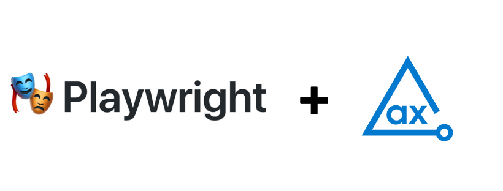

# axe DevTools Playwright API Example

Using axe DevTools Playwright, you can integrate axe DevTools into your existing testing environment. This example project demonstrates how axe DevTools Playwright is used to detect accessibility issues and generates reports in CSV, HTML, JSON, and XML formats.

## Prerequisites

- npm
- NodeJS (6.10 or higher)

## Clone Project

Follow these steps to clone and navigate to the directory:

1. Clone this repo from GitHub.
2. Open the project in your favourite editor.
3. Navigate from the root of the repo to this example with the following command:

```sh
cd Node/playwright
```

## Install Dependencies

Install the dependencies including **axe DevTools Playwright** and **DevTools Reporter** for the project.

> **_NOTE:_**
> You need a valid license to use our APIs. For more information, see [Install from Deque’s Agora](https://docs.deque.com/devtools-html/4.0.0/en/node-pl-install-agora) page. After configuring the access to Deque's private registry, you can install the dependencies for this project.

The following command installs all the required dependencies to run this example project.

```sh
npm install
```

## Test Configuration

You can configure multiple browsers as you would like in the **`playwright.config.js`**

```js
projects: [
  {
    name: 'chromium',
    use: {
      ...devices['Desktop Chrome']
    }
  },

  {
    name: 'firefox',
    use: {
      ...devices['Desktop Firefox']
    }
  },

  {
    name: 'webkit',
    use: {
      ...devices['Desktop Safari']
    }
  }
]
```

> To learn more about test configuration, see [Playwright documentation](https://playwright.dev/docs/test-configuration).

## Run Tests

The **_tests_** directory contains the example test file **`example.spec.js`** that analyzes the page `https://broken-workshop.dequelabs.com/` for accessibility issues.

The following command runs the test file in the **_tests_** directory.

```sh
npm test
```

> To learn more about commands, see [Playwright documentation](https://playwright.dev/docs/test-cli).

## Test Results

The tests generate results in the **_a11y-results_** directory. Check each subdirectory for the respective format.

The **`/html/executive-report.html`** file is an executive summary report aggregating results from all scans into one page.

## Test Run Configuration

**`npm test`** runs the **`rimraf`** command mentioned in the **`package.json`**.

```json
  "scripts": {
    "test": "rimraf ./a11y-results/ && npx playwright test --headed"
  },
```

Every time you run **`npm test`**, the **`rimraf`** command clears all saved results from the **`a11y-results`** directory, so if you want to retain previous test results, you should remove **`rimraf`** from the **`scripts`** object.

If you want to modify this project and publish your results in a folder other than **`./ally-results`**, you should update the output directory in the test file and the **test** parameter.

## Additional Information

- [axe DevTools Playwright Overview](https://docs.deque.com/devtools-html/4.0.0/en/node-pl-overview)
- [Playwright API Reference](https://docs.deque.com/devtools-html/4.0.0/en/node-pl-ref-overview)
- [axe-core Rule Descriptions](https://github.com/dequelabs/axe-core/blob/master/doc/rule-descriptions.md)
